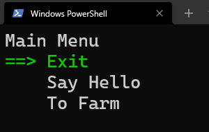
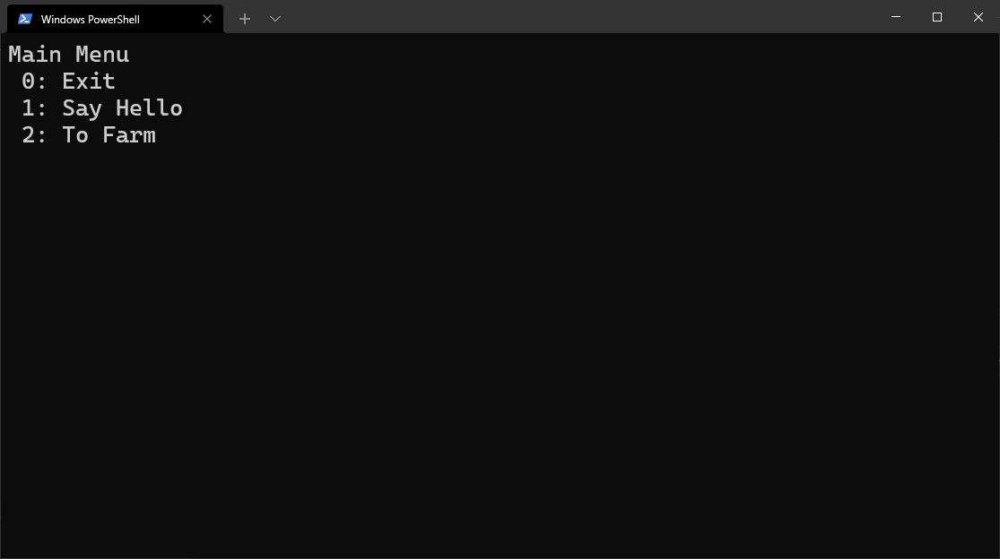
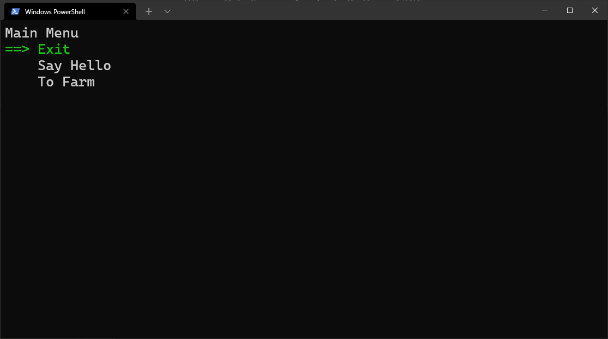
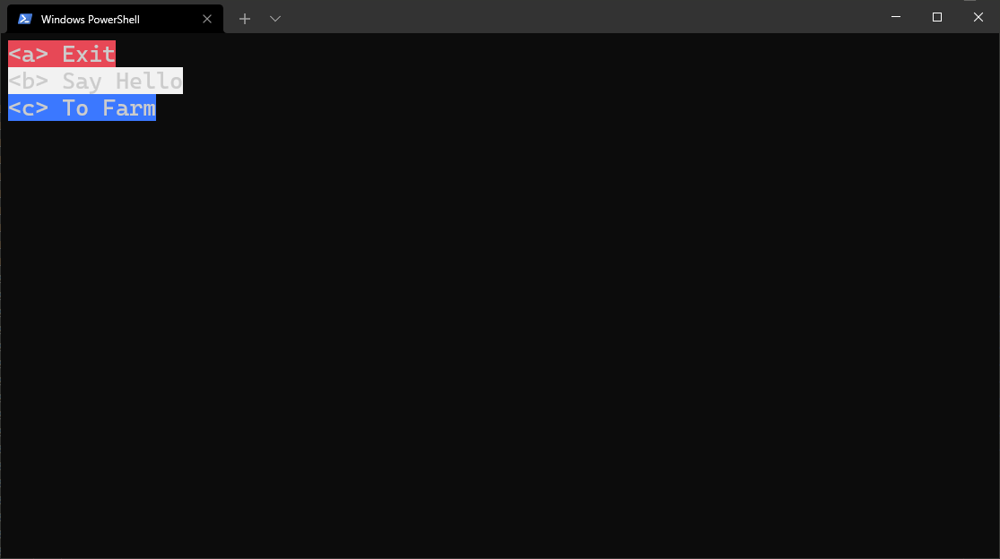

# ConsoleMenu

ConsoleMenu is a simple, extensible framework for creating basic CLI interfaces. Flexibility, extensibility, and simplicity are the main tenets of this library.

ConsoleMenu gives you the bare minimum to get a very basic yet functional CLI interface up and running quickly. However, you can drop in a completely custom interface.

# Installation

ConsoleMenu targets `net5.0`.

Clone this repo and add a reference to `ConsoleMenu.csproj`.

To run the sample app, install [.NET 5.0 SDK](https://dotnet.microsoft.com/download/dotnet/5.0) and run `dotnet run` in the `ConsoleMenuDemo` directory.



# Basic Usage

To create a basic menu, create an instance of `Menu` and call the `Add` method to add items. When finished building the menu, call `Run()` to start the loop:

```csharp
    var menu = new Menu("Main Menu")
        .Add("Exit" (m) => m.Close())
        .Add("Say Hello", () => Console.WriteLine("Hello, world!"));

    menu.Run();
```

# Nested Sub-menus

Menus can also be created with sub-menus. Just create another instance of `Menu`, add items to it, and pass it to the parent `Menu`'s `Add` method:

```csharp
    var subMenu = new Menu("Main Menu")
        .Add("Go Back", (m) => m.Close())
        .Add("Feed Animals", => FeedAnimals);

    var menu = new Menu("Farm")
        .Add("Exit" (m) => m.Close())
        .Add("Say Hello", () => Console.WriteLine("Hello, world!"))
        .Add("To Farm", subMenu);

    menu.Run();

    void FeedAnimals()
    {
        // ... Feeding the animals
    }
```

`Add` returns a `Menu` instance, so the above can be rewritten more efficiently:

```csharp
    var menu = new Menu("Main Menu")
        .Add("Exit", (m) => m.Close())
        .Add("Say Hello", () => Console.WriteLine("Hello, world!"))
        .Add("To Farm", new Menu("Farm")
            .Add("Go Back", (m) => m.Close())
            .Add("Feed Animals", => FeedAnimals));

    menu.Run();

    void FeedAnimals()
    {
        // ... Feeding the animals
    }
```

# Customization

Two different types of menus are implemented out of the box: a scrolling menu and a selection menu. You can specify the interface to use by assigning a `Processor` instance to the `Menu.Processor` field.

### Scrolling Menu

- The scrolling menu is a DOS-like menu where you can use the arrow keys to move the currently selected item and press `enter` to select it. `vim`-like keybinds are supported: `J` to scroll down, `K` to scroll up, `L` to select.

### Selection Menu

- The selection menu is a numbered menu, where typing the number of a selection selects it. If a number is typed that doesn't exist on the menu, an invalid selction message is displayed.

Custom menus may be created by extending the `Processor` class and implementing its members.

If no `Processor` is defined, the selection menu is defaulted.

For example, the following:
```csharp
    var menu = new Menu("Main Menu")
            .Add("Exit", (m) => m.Close())
            .Add("Say Hello", () => Console.WriteLine("Hello, world!"))
            .Add("To Farm", new Menu("Farm")
                .Add("Go Back", (m) => m.Close())
                .Add("Feed Animals", () => Console.WriteLine("FeedAnimals")));
                
        Menu.Processor = new SelectionProcessor();
        menu.Run();
```
Outputs:


And to get a scroll menu:
```csharp
    var menu = new Menu("Main Menu")
            .Add("Exit", (m) => m.Close())
            .Add("Say Hello", () => Console.WriteLine("Hello, world!"))
            .Add("To Farm", new Menu("Farm")
                .Add("Go Back", (m) => m.Close())
                .Add("Feed Animals", () => Console.WriteLine("FeedAnimals")));
                
        Menu.Processor = new ScrollProcessor();
        menu.Run();
```


# Events

There are currently 2 events that are raised:

- `KeyPressed`: Keyboard input was received on the console
- `NotifyCollectionChangedEventHandler? ObservableCollection<MenuItem>.CollectionChanged`: The `MenuItems` `ObservableCollection` was changed
- `Closing`: The menu's `Close` method was called

# Extensibility

The internal functionality of ConsoleMenu is not very extensible. However, the interface is completely extensible.

At its core, ConsoleMenu does the bare minimum of handing console input and notifying when the interface handler (called `Processor`s) should redraw the menu and passing that input to the `Processor`.

To create a custom interface, extend the `Processor` class and implement its members:

```csharp
class MyCustomProcessor : Processor
{
    private static readonly char[] Letters = {'a', 'b', 'c', 'd' }; // ... and so on...

    public MyCustomProcessor(): base()
    {
        Menu.KeyPressed += OnConsoleInput;
    }

    public override void OnConsoleInput(object sender, ConsoleKeyInfo keyInfo)
    {
        bool found = false;
        for (int i = 0; i < Letters.Length; i++)
        {
            if (keyInfo.KeyChar == Letters[i])
            {
                found = true;
                Menu.MenuItems[i].Action?.Invoke();
                break;
            }
        }

        if (!found)
            Console.WriteLine("Invalid selection.");
    }

    public override void Redraw()
    {
        int[] colors = { (int) ConsoleColor.Red, (int) ConsoleColor.White, (int) ConsoleColor.Blue };

        var i = 0;
        foreach (var item in Menu.MenuItems)
        {
            Console.BackgroundColor = (ConsoleColor) colors[i & 3];
            ItemHandler?.Invoke(item);
            Console.ResetColor();
            
            i = (i + 1) % 3;
        }
    }

    public override Action<MenuItem> ItemHandler
    {
        get => (item) => Console.WriteLine($"<{Letters[item.Index]}> {item.Name}");
        set => _itemHandler = value;
    }
}
```

Then assign an instance of that class to the `Menu.Processor` property:
```csharp
    var menu = new Menu("Main Menu")
        .Add("Exit", (m) => m.Close())
        .Add("Say Hello", () => Console.WriteLine("Hello, world!"))
        .Add("To Farm", new Menu("Farm")
            .Add("Go Back", (m) => m.Close())
            .Add("Feed Animals", () => Console.WriteLine("FeedAnimals")));
            
    Menu.Processor = new MyCustomProcessor();
    menu.Run();
```


