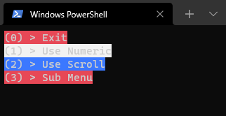

# ConsoleMenu

A simple, extensible library for creating command-line interfaces. Flexibility, extensibility, and simplicity are the main tenets of this library.

# Basic Usage

To create a basic menu, create an instance of `Menu` and call the `Add` method to add items. When finished building the menu, call `Run()` to start the loop:

```csharp
    var menu = new Menu("Main Menu")
        .Add("Exit" (m) => m.Close())
        .Add("Say Hello", () => Console.WriteLine("Hello, world!"));

    menu.Run();
```

# Nested Sub-menus

Menus can also be created with sub-menus. Just create another instance of `Menu`, add items to it, and pass it to the parent `Menu`'s `Add` method:

```csharp
    var subMenu = new Menu("Main Menu")
        .Add("Go Back", (m) => m.Close())
        .Add("Feed Animals", => FeedAnimals);

    var menu = new Menu("Farm")
        .Add("Exit" (m) => m.Close())
        .Add("Say Hello", () => Console.WriteLine("Hello, world!"))
        .Add("To Farm", subMenu);

    menu.Run();

    void FeedAnimals()
    {
        // ... Feeding the animals
    }
```

Alternatively:

```csharp
    var menu = new Menu("Main Menu")
        .Add("Exit", (m) => m.Close())
        .Add("Say Hello", () => Console.WriteLine("Hello, world!"))
        .Add("To Farm", new Menu("Farm")
            .Add("Go Back", (m) => m.Close())
            .Add("Feed Animals", => FeedAnimals));

    menu.Run();

    void FeedAnimals()
    {
        // ... Feeding the animals
    }
```

# Customization

There are currently 2 Navigation formats to choose from:

- `Navigation.Numeric`
    - Typing numbers on the keypad select the corresponding action, or displays an invalid selection message.
- `Navigation.Scroll`
    - Arrow keys are used to highlight an item, pressing `ENTER` on the keyboard selects the action.
    - `vim`-like keybinds are supported (`J` to scroll down, `K` to scroll up, `L` to select)

# Events

There are currently 2 events that are raised:

- `NavChanged`: Navigation style was changed
- `Closing`: The menu's `Close` method was called

# Extensibility

You can assign your own delgate to change how menu items are printed to the console via `Menu`'s `ItemHandler` property:

```csharp
    var menu = new Menu("Main Menu")
        .Add("Exit", (m) => m.Close())
        .Add("Say Hello", () => Console.WriteLine("Hello, world!"))
        .Add("To Farm", new Menu("Farm")
            .Add("Go Back", (m) => m.Close())
            .Add("Feed Animals", => FeedAnimals));

    Menu.ItemHandler = (MenuItem item) => Console.WriteLine($"<{i.Index}> {i.Name}");
    menu.Run();

    void FeedAnimals()
    {
        // ... Feeding the animals
    }
```

You can do the same thing for the `RenderHandler` property:

```csharp
    var menu = new Menu("Main Menu")
        .Add("Exit", (m) => m.Close())
        .Add("Say Hello", () => Console.WriteLine("Hello, world!"))
        .Add("To Farm", new Menu("Farm")
            .Add("Go Back", (m) => m.Close())
            .Add("Feed Animals", => FeedAnimals));

    Menu.RenderHandler = (Menu m) => {
        int[] colors = { (int) ConsoleColor.Red, (int) ConsoleColor.White, (int) ConsoleColor.Blue };

        var i = 0;
        foreach (var item in m.MenuItems)
        {
            Console.BackgroundColor = (ConsoleColor) colors[i & 3];
            Menu.ItemHandler?.Invoke(item);
            Console.ResetColor();
            
            i = (i + 1) % 3;
        }
    };
    menu.Run();

    void FeedAnimals()
    {
        // ... Feeding the animals
    }
```

